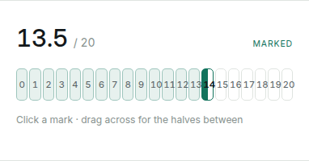

# Handover — whole-mark chips for the Adu / Raagu selector

**For:** Codex
**Branch:** cut from `main`, push as `codex/mark-chips`
**Scope:** one component and its stylesheet block. No data, no store, no exports.

---

## What exists today

Pressing the Adu / Raagu mark in the score row opens a **ruler strip**: a
continuous track with a tick per half mark, a taller tick per whole mark, and a
label every fifth once the allocation passes twelve. You drag along it and
release on a value.

It works, but every target is a 12px slice of a line. There is nothing to aim
at for a judge who wants to *tap* 14 rather than *slide* to it.

## What to build

Replace the track with **whole-mark chips**: one real button per whole mark,
`0 … max`. A half mark comes from pressing the **left half** of a chip — so
the left half of chip 14 is 13.5, and the right half is 14. Halves are a
refinement of a chip, never a chip of their own.



*Above: 13.5 of 20. Chips 0–13 are filled, chip 14 is split down the middle to
show the half. This is the live prototype in
[`adu-raagu-input-study.html`](./adu-raagu-input-study.html), section 04-B.*

### Why the split chip

The alternative — a chip per half mark — doubles the count to 41 and makes
every target unreadable at this width. Rendering the half as a **half-filled
chip** keeps the row countable (`0…20` reads as marks out of twenty) while
still showing the exact value. The number in the chip stays whole; the fill
carries the half.

---

## The prototype, and what it maps to

Working code lives in `docs/adu-raagu-input-study.html`. Do not copy it
verbatim — it is imperative DOM code and the real component is React. Take the
behaviour from it:

```js
// docs/adu-raagu-input-study.html:1879-1905 — the whole gesture
function chipValue(event, element) {
  var mark = Number(element.dataset.mark);
  var rect = element.getBoundingClientRect();
  // The left half of a chip reads as the half mark below it.
  return event.clientX - rect.left < rect.width / 2 ? Math.max(0, mark - 0.5) : mark;
}

chipRoot.addEventListener("pointerdown", function (event) {
  var button = event.target.closest("[data-mark]");
  if (!button) return;
  event.preventDefault();
  chipDrag = true;
  chipRoot.setPointerCapture(event.pointerId);
  chips.preview(chipValue(event, button));       // preview only
});
chipRoot.addEventListener("pointermove", function (event) {
  if (!chipDrag) return;
  // elementFromPoint, because the press may have left the chip it started on
  var element = document.elementFromPoint(event.clientX, event.clientY);
  var button = element && element.closest("[data-mark]");
  if (button && chipRoot.contains(button)) chips.preview(chipValue(event, button));
});
["pointerup", "pointercancel"].forEach(function (type) {
  chipRoot.addEventListener(type, function () {
    if (!chipDrag) return;
    chipDrag = false;
    chips.commit(chips.value, 1);                // one ledger event per gesture
  });
});
```

Per-chip state, also from the prototype (line 1869):

| Class / attribute | When |
| --- | --- |
| `aria-checked="true"` | this chip is the value, **or** carries its half |
| `.is-half` | the value is `mark − 0.5` — render the split fill |
| `.is-filled` | `mark < value` — the run of marks below the chosen one |

---

## Files to change

### 1. `src/components/MarkPicker.tsx`

The component already owns everything you need: `preview` / `value` /
`commit()` / `clamp()`, the open-and-pinned bar lifecycle, the portal, the
anchor maths, Escape and outside-press closing, and the keyboard map. **Leave
all of that alone.**

Replace only what renders inside `.mark-bar`:

- **Remove:** the `.mark-bar-track` div, its three pointer handlers, the
  `ascending.map(...)` tick loop, `.mark-bar-fill`, `.mark-bar-thumb`, and the
  `markAt()` helper (it maps an x-position across a continuous track and has no
  meaning once the strip is chips).
- **Add:** a `.chip-strip` div rendering `0 … Math.round(max)` whole chips, with
  the three handlers above written as React props.

Keep these exactly as they are — they are decided behaviour, not incidental:

- Nothing commits until the press **ends**. A whole gesture writes exactly one
  ledger event, which is what keeps the judging history readable.
- A press that does not move leaves the bar **pinned open** to click from
  (`pinned` state). The chips must work in both modes: drag-and-release, and
  click-once-while-pinned.
- The keyboard map in `onKeyDown` (arrows, Shift-arrow, Home, End, digits) acts
  on the button, not the strip. Untouched.
- `role="listbox"` on the bar becomes `role="radiogroup"` on the strip, with
  `role="radio"` per chip — the prototype's roles are correct, the current
  listbox roles are not.

`DENSE_MARK_COUNT` (line 19) governs tick labelling and dies with the ticks.

### 2. `src/styles/global.css`

Replace the `.mark-bar-track` / `.mark-tick` / `.mark-bar-fill` /
`.mark-bar-thumb` rules with a `.chip-strip` block. Start from the prototype's
CSS at `adu-raagu-input-study.html:637-668`, then convert its colours to the
app's tokens.

**Read this before you pick colours — it is the one trap in this task.** The
bar is rendered through `createPortal(..., document.body)`, so it is *not* a
DOM descendant of the score row. CSS custom properties inherit through the DOM
tree, not the React tree, so **`--c` does not reach the bar**. Verified in the
running app: the row resolves `--c: #2e9e83`, the bar resolves `--c` as unset,
and `.mark-bar-thumb` therefore paints `rgb(26, 26, 28)` — the ink fallback in
`var(--c, var(--ink))`, not the criterion's teal.

So write the chips against **ink**, matching what the ruler actually renders
today:

| Prototype | Use instead |
| --- | --- |
| `var(--accent)` | `var(--c, var(--ink))` — resolves to ink in the portal, exactly as the thumb does today |
| `var(--accent-soft)` | `var(--c-tint, var(--bg))` |
| `var(--accent-line)` | `var(--line-2)` |
| `var(--surface)`, `var(--line)`, `var(--ink-2)` | same names, already exist |

Keeping the fallbacks means this change is about the control's **shape**, not
its colour — the bar looks exactly as it does now, only chipped instead of
ticked. That keeps the diff reviewable.

The split-chip fill is a hard-stop gradient on the same token:

```css
.chip-strip button.is-half {
  background: linear-gradient(
    to right,
    var(--c, var(--ink)) 50%,
    var(--surface) 50%
  );
}
```

If the teal is wanted later, it is one line — give the portalled `.mark-bar`
div the row's `cat-adu-raagu` class so `--c` is defined on it. **Do not do
this as part of this task**; it recolours the whole bar and is a separate
decision for Yaish.

**Width, and the one thing the study got stuck on.** 21 chips inside the
520px bar leaves ~22px each, below a comfortable target — the study's own
verdict was "good to 12 marks, awkward past that". Solve it by letting the
strip **wrap**: `flex-wrap: wrap` with `min-width: 30px` on the chip. Up to
about twelve marks it stays one row; a 20-mark allocation becomes two tidy
rows instead of one cramped one. The bar's height is not fixed, and
`useLayoutEffect` re-measures `barRef.current.offsetHeight` when positioning,
so a taller bar already flips above the button correctly when space is short.

---

## Acceptance criteria

1. A 20-mark allocation with a 0.5 step shows chips `0…20`, no chip under 30px,
   wrapping to a second row rather than shrinking.
2. Pressing the **right** half of chip 14 gives 14. The **left** half gives
   13.5, and chip 14 renders split.
3. Press, drag across several chips, release → the value follows the pointer
   the whole way and commits **once**. Exactly one `impression_changed` event
   in the ledger for the gesture.
4. A press with no movement leaves the bar open; a single click on a chip then
   sets that value and closes the bar.
5. Escape, outside-press, scroll and resize still close the bar. The keyboard
   map still works from the button.
6. No new hue. The strip renders in ink, the same as the current thumb — see
   the portal trap above.
7. Light and dark themes both legible, including the split chip.

## Tests

Add to `scripts/adu-raagu.test.mjs`, beside the existing
`"the mark bar opens on a press and commits when the press ends"` test, which
asserts on `.mark-tick` and `labelEvery` and **will need updating** — those
things no longer exist.

Cover: chips are whole marks only; the left half resolves to `mark - 0.5`;
commit happens on pointer-up, not on move; `.is-half` / `.is-filled` /
`aria-checked` are all driven from the value. The file reads component source
and asserts against it — follow that existing style rather than inventing a
harness. There is a `ruleBody(selector)` helper near the top for asserting on
CSS declarations.

Full suite must stay green: `npm test` (196 tests as of `a048699`).

## Verify before pushing

```bash
npm test && npm run build
```

Then drive it for real — do not ship this on tests alone, it is a gesture:

```bash
npx vite --port 5178
```

Open a competition with Adu / Raagu at **20 marks, 0.5 step** (Marks and
criteria → save → Review and start → Start sample), begin judging, and
exercise every path in the acceptance list. Screenshot the strip at 13.5 in
both themes and confirm it matches `docs/mark-chips-target.png`.

## Push

```bash
git checkout -b codex/mark-chips
git commit -am "Mark Adu / Raagu on whole chips"
git push -u origin codex/mark-chips
```

Open a PR against `main`. Do not push to `main` directly.

---

## Notes for whoever reviews this

The study's measured verdict on chips at 20 marks was *"halves are invisible
until you drag"* — a judge who has never dragged one will not know the halves
are reachable. The ruler being replaced showed every half as a visible tick.
The wrap rule above fixes the cramping but not the discoverability; the
prototype's hint line (`Click a mark · drag across for the halves between`)
carries that weight, so **keep a hint of that wording** in `.mark-bar-hint`
when the bar is pinned. If halves turn out to be missed in real judging, the
fallback is section 04-C of the study (coarse then fine), which was the
touch-first answer.
