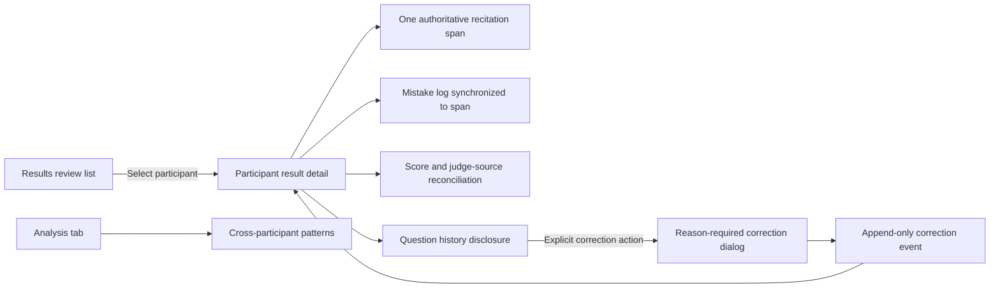

# Participant recitation evidence: detailed implementation plan

Status: Phases 1–4 implemented in the real app; no post-Ready correction rule added<br>
Prepared: 2026-08-19<br>
Baseline: local commit `40d6f33e4a300bec69c04aab456e8e3a9d211f8d` (unpublished; ten commits ahead of the tracked branch)<br>
Live surface audited: [Tahqeeq Results](https://tahqeeq-mobile.yaish.chatgpt.site/?verify=analysis63b)

## Executive verdict

The exact recited area belongs in **Results → participant detail**, not in the
aggregate Analysis tab and not inside the current 300px score/source sidebar.
Analysis should later answer cross-participant questions; the participant result
record should answer: what was assigned, what was recited, what was marked, by
whom, and what was later corrected.

The next safe update is therefore a dedicated, read-only participant evidence
surface inside Results. It should show one authoritative recitation span, the
mistakes anchored to that span, and explicit missing/conflicting evidence states.
Question correction should follow as an append-only, reason-required workflow.
It must never silently swap the visible Mushaf range or reinterpret a participant
reciting the wrong question as a clerical correction.

Two engineering gaps must be fixed before the UI can truthfully claim an exact
recitation cutout:

1. the frozen `ReciterQuestionAssignment` currently drops exact line and word
   boundary fields that already exist on `CompetitionQuestionDraft`; and
2. finalized results can combine judge-source sessions without proving that the
   selected sessions refer to the same question.

This plan does not assume those gaps away. Until the evidence is exact and
consistent, the UI must show a precise unavailable/conflict state rather than a
plausible-looking Quran range.

## What is verified, inferred, and proposed

| Kind | Finding |
| --- | --- |
| Verified in code | Prepared question drafts already contain page, line, word, marker, layout, and source-version boundaries. |
| Verified in code | Frozen participant assignments retain page and ayah bounds but omit line/word/marker bounds. |
| Verified in code | Saved sessions may have no question at all because `question` is optional for compatibility. |
| Verified in code | Finalized results store selected category-source IDs/revisions but no authoritative question snapshot or question fingerprint. |
| Verified in code | Import validation checks competition, roster, judge assignment, and score configuration, but not question agreement. |
| Verified in browser | At 1280×800 the current table is about 853px wide and the right evidence panel is 300px; at 1024×768 the table is about 646px and the panel is 276px. That panel is suitable for source reconciliation, not Mushaf evidence. |
| Verified in code | The full judging state, including participant data and evidence, is persisted as plaintext JSON in `localStorage` and duplicated under migration backup keys. |
| Inference | A dedicated detail surface will be clearer and safer than enlarging the current sidebar because the Mushaf becomes the evidence rather than secondary chrome. |
| Proposal | Build the read-only evidence model and renderer first; add post-Ready question correction only after actor authorization and rule implications are decided. |
| Not decided | Whether a question-evidence conflict blocks score finalization, who may correct a question, and how a participant reciting the wrong question affects scoring. |

## Placement and information architecture

The screen relationship should be:



This is a list-detail pattern: a list indexes records, and selecting a record
reveals its in-depth detail. Official Android adaptive-layout guidance describes
this exact relationship and recommends side-by-side panes only when enough width
exists, with detail taking over when space is limited. Tahqeeq does not need the
Android library; the information-architecture principle is the useful part.

The first desktop implementation should deliberately use a **full-width detail
state** even at 1280px. It gives the Quran text enough room, avoids overloading the
existing sidebar, and makes the later compact adaptation straightforward: list
and detail are already separate states, not one fragile three-column layout.

## Design-grammar contract

The implementation must be failed against the app's existing
[`DESIGN_GRAMMAR.md`](./DESIGN_GRAMMAR.md),
especially these rules:

- **The page is the evidence.** The recitation cutout is the dominant area.
- **One thing has one home.** Question identity and correction live in the
  question-evidence header/history, not in multiple menus.
- **Colour is a verdict.** Category colour appears only on actual mistake
  markers and their matching log entries. Statuses and judge sources stay
  near-monochrome and use text, not coloured cards.
- **Nothing is ever set by accident.** Merely selecting or focusing another
  question cannot make it primary.
- **Say it once.** Participant identity, question, score, and status each get one
  clear primary location.
- **Nothing is unreachable.** Check 1400×900, 1280×800, and 1024×768.
- **Use the fixed scale.** Reuse the 4px spacing grid, 8/12/20 radii, and fixed
  type tokens; do not invent a parallel Results design system.

### Retain, recompose, remove

| Treatment | Current element | Plan |
| --- | --- | --- |
| Retain | Results tabs, participant filters, participant table, score at the right, plain text states | Keep as the review index. |
| Retain | Existing source selection and finalization behavior | Preserve inside a compact reconciliation section; do not rewrite scoring in the visual slice. |
| Retain | QCF V1 page data/font loader and stable `wid` addresses | Extract shared read-only rendering helpers rather than duplicating Quran text logic. |
| Recompose | Participant selection | Open a dedicated participant-detail state with a clear Back to results action. |
| Recompose | Current evidence sidebar | Split into participant header, Mushaf evidence, mistake log, sources, and audit/history sections. |
| Recompose | Question display | Show one primary question identity; put prior/corrected assignments in a collapsed history disclosure. |
| Remove | Category-coloured source cards or broad tinted status cards | Use plain surfaces, line separators, text labels, and category colour only where a mistake is actually represented. |
| Remove | Silent question dropdown in the main evidence view | A consequential correction must be a separate deliberate action with comparison and reason. |
| Remove | Any attempt to infer the recited span from first/last mistake | Errors are not a transcript and cannot prove unmarked boundaries. |

## Linked issue index

### Visual issues

| ID | Severity | Issue | Primary evidence |
| --- | --- | --- | --- |
| [V-01](#v-01-the-mushaf-evidence-has-no-appropriate-home) | Release-blocking for this feature | Mushaf evidence has no appropriate home | [Current 300px workbench CSS](../src/styles/global.css) (`8639–8646`) |
| [V-02](#v-02-the-current-sidebar-mixes-five-different-jobs) | High | Sidebar mixes identity, state, score, reasons, source selection, and finalization | [Current evidence panel](../src/components/FinalResultsPanel.tsx) (`220–354`) |
| [V-03](#v-03-question-identity-and-history-are-not-visible) | High | Question identity/history are absent from Results | [Evidence head](../src/components/FinalResultsPanel.tsx) (`242–270`) |
| [V-04](#v-04-cross-page-continuity-needs-an-explicit-visual-rule) | High | Cross-page cutout behavior is unspecified | [Existing whole-page preview](../src/components/QuestionMushafPreview.tsx) (`160–220`) |
| [V-05](#v-05-category-colour-must-not-expand-into-general-status-colour) | High | Category colour can clash with status/source UI | [Design colour rule](./DESIGN_GRAMMAR.md) (`31–45`) |
| [V-06](#v-06-mistake-navigation-needs-a-stable-two-way-focus-model) | High | Log-to-word and word-to-log navigation is undefined | [Mistake word identity](../src/types.ts) (`59–88`) |
| [V-07](#v-07-missing-and-conflicting-evidence-must-look-deliberately-different) | High | Missing/conflicting evidence could be mistaken for loading or empty content | [Current review reasons](../src/lib/resultsReview.ts) |
| [V-08](#v-08-print-and-screen-must-share-the-evidence-model-not-the-layout) | Medium | Screen and print risk diverging | [Current active-session sheet](../src/components/ResultSheet.tsx) |

### Engineering and security issues

| ID | Severity | Issue | Primary evidence |
| --- | --- | --- | --- |
| [E-01](#e-01-the-frozen-assignment-drops-exact-range-boundaries) | Release-blocking | Frozen assignment drops line/word/marker bounds | [Draft and assignment fields](../src/types.ts) (`288–343`) |
| [E-02](#e-02-manual-questions-have-no-renderable-range) | Release-blocking for manual questions | Manual assignment has no Quran span | [Manual assignment constructor](../src/lib/reciterQuestions.ts) (`85–101`) |
| [E-03](#e-03-finalized-results-do-not-freeze-question-evidence) | High | Finalized result does not freeze question evidence | [FinalizedResult](../src/types.ts) (`453–480`) |
| [E-04](#e-04-multi-judge-sources-are-not-checked-for-question-agreement) | Release-blocking | Selected judge sources can disagree on question | [Preview assembly](../src/lib/finalResults.ts) (`99–166`) |
| [E-05](#e-05-import-validation-does-not-compare-question-evidence) | High | Imports do not compare question fingerprint | [Import checks](../src/components/RecordsView.tsx) (`349–390`) |
| [E-06](#e-06-there-is-no-post-ready-question-correction-event) | Release-blocking for correction | No append-only post-Ready correction event | [Judging event union](../src/types.ts) (`103–196`) |
| [E-07](#e-07-legacy-sessions-may-have-no-question) | High | Legacy sessions can lack question evidence | [SavedSession](../src/types.ts) (`482–510`) |
| [E-08](#e-08-the-current-preview-is-an-interactive-builder-not-a-read-only-cutout) | High | Existing renderer is a whole-page question builder | [Question preview interaction](../src/components/QuestionMushafPreview.tsx) (`65–175`) |
| [E-09](#e-09-mistakes-can-be-unresolved-or-outside-the-effective-range) | High | Marker resolution and out-of-range handling are undefined | [Mistake migration status](../src/types.ts) (`59–88`) |
| [E-10](#e-10-quran-page-and-font-provenance-have-different-runtime-boundaries) | High | Page JSON is same-origin but page fonts are third-party runtime resources | [Page loader](../src/lib/page.ts) (`111–128`), [font loader](../src/lib/qcfFont.ts) |
| [E-11](#e-11-print-fragmentation-can-split-semantic-evidence) | Medium | Printed page breaks can separate labels, Quran lines, and mistakes | [W3C CSS Fragmentation](https://www.w3.org/TR/css-break-3/) |
| [S-01](#s-01-sensitive-competition-state-is-plaintext-in-localstorage) | Production-blocking for real PII | Full competition/evidence state is plaintext in localStorage | [Persistence code](../src/state/store.tsx) (`1493–1560`) |
| [S-02](#s-02-export-files-are-plaintext-and-need-an-explicit-data-handling-contract) | High | Judge result and backup JSON contain PII/evidence | [Result package export](../src/lib/resultPackages.ts) (`49–123`) |
| [S-03](#s-03-the-shipped-checkpoint-prototype-uses-innerhtml) | Medium | Public checkpoint prototype retains `innerHTML` code | [Prototype](../public/results-redesign-checkpoint-1.html) (`760–834`) |

## Visual issue details and resolutions

### V-01: The Mushaf evidence has no appropriate home

The current workbench explicitly reserves 300px for the sticky evidence panel.
That is enough for source selection and one action, but not enough to preserve
Mushaf line geometry, cross-page continuity, error anchors, and readable Arabic.

**Resolution:** selecting a participant moves Results into a dedicated detail
state. Keep the Results tabs and page header, then use the remaining width for
the evidence. The list is one Back action away and selection should be reflected
in the URL or stable local view state so refresh does not unexpectedly select a
different participant.

**Acceptance:** at 1400×900, 1280×800, and 1024×768, the Quran evidence has no
horizontal scrollbar; the screen has only one primary vertical scroll owner; Back
returns to the same list filters and participant position.

### V-02: The current sidebar mixes five different jobs

The panel presently combines participant identity, result state, score, review
reasons, judge-source selection, and finalization. Adding Mushaf evidence there
would make all six jobs compete.

**Resolution:** participant detail has this order:

1. compact participant header: number/name/context left, score/state right;
2. question-evidence bar: effective question, page span, evidence status;
3. Mushaf cutout as the dominant content;
4. synchronized mistake log as the supporting pane;
5. source reconciliation and finalization;
6. collapsed question and revision history.

The order follows the evidence question first, administrative reconciliation
second. It avoids presenting judge-source controls as if they were the recitation.

### V-03: Question identity and history are not visible

Results currently does not show which question generated the record. That makes
the displayed evidence impossible to audit and invites silent switching.

**Resolution:** a plain, near-monochrome question bar states the effective range,
page(s), source type (`Prepared question` or `External question`), and evidence
status. A `Question history` disclosure lists the original assignment and any
corrections. Only the effective assignment is rendered as the main Quran area.
Prior assignments never appear as parallel primary cards.

### V-04: Cross-page continuity needs an explicit visual rule

For a span that starts near the bottom of one page and ends near the top of the
next, render only the selected printed lines, in order:

- page header above each page segment: Arabic surah name(s) and page number;
- first page's selected lines;
- a quiet 16–24px page seam with a thin neutral rule;
- next page header and selected lines;
- no recreated footer ornaments inside the middle of the evidence.

The page number moves into the segment header for the cutout. This is an evidence
view, not a photograph of the original full page. The underlying line breaks and
QCF glyph order remain unchanged.

### V-05: Category colour must not expand into general status colour

W3C WCAG says colour cannot be the sole way to convey a state. Tahqeeq's own
grammar is stricter: saturated category colour is a verdict. Therefore:

- `Needs review`, `Ready`, and `Finalized` remain text labels with weight and
  optional neutral iconography—not coloured bordered pills;
- judge-source rows remain neutral;
- category colour is used on a small word marker, its matching mistake-log
  marker, and no broader surface;
- every coloured marker also has category text and an accessible name.

Research: [WCAG 2.2 Use of Color](https://www.w3.org/WAI/WCAG22/Understanding/use-of-color.html)
and [Non-text Contrast](https://www.w3.org/WAI/WCAG22/understanding/non-text-contrast.html).

### V-06: Mistake navigation needs a stable two-way focus model

Selecting a mistake should scroll the exact `wordId`/`tid` into view, place a
neutral focus ring around the word marker, and announce the location/category.
Selecting a marked Quran word should select and reveal the matching log row.

The active state is not a second category colour. Use a neutral outline and
subtle surface change; the small category marker retains the verdict colour.
The DOM and keyboard order must remain logical even when the mistake log is
visually beside the Mushaf.

Research: [WCAG Focus Order](https://www.w3.org/WAI/WCAG22/Understanding/focus-order.html),
[Focus Not Obscured](https://www.w3.org/WAI/WCAG22/Understanding/focus-not-obscured-minimum.html),
and [Target Size Minimum](https://www.w3.org/WAI/WCAG22/Understanding/target-size-minimum.html).

### V-07: Missing and conflicting evidence must look deliberately different

The main area needs explicit states, not a blank card:

| State | Main message | Allowed actions |
| --- | --- | --- |
| Loading | `Loading recorded Quran pages…` | Back; retry after failure |
| Ready | Exact cutout and mistakes | Navigate mistakes; print/export when implemented |
| Legacy missing | `This older result did not record an exact question range.` | View score/mistakes; no fake cutout |
| Manual missing | `External question — exact span was not recorded.` | Correct recorded question only if authorized |
| Source conflict | `Selected judge results refer to different questions.` | Compare sources; no unified cutout |
| Source/version mismatch | `Recorded Mushaf source does not match the available renderer.` | Preserve metadata; do not reinterpret |
| Load failure | `The recorded page could not be loaded.` | Retry; retain range metadata |

### V-08: Print and screen must share the evidence model, not the layout

The existing `ResultSheet` describes the active in-progress session. A saved
participant report is a different artifact. Build a separate print component fed
by the same `ParticipantEvidenceModel` as the detail screen. The screen can have
sticky/navigation controls; print needs stable headers, no controls, and explicit
page-break rules.

## Engineering issue details and resolutions

### E-01: The frozen assignment drops exact range boundaries

`CompetitionQuestionDraft` already has `startLine`, `endLine`, `startWordId`,
`endWordId`, `endMarkerId`, extension lines, and final-line scoring. The current
assignment constructor copies only ayah/page/count/provenance fields.

**Resolution:** introduce a versioned immutable range snapshot and copy it at
assignment time; do not look the draft up later and assume it is unchanged.

```ts
interface RecitationRangeSnapshotV1 {
  version: 1;
  startAyah: AyahRef;
  endAyah: AyahRef;
  startPage: number;
  startLine: number;
  endPage: number;
  endLine: number;
  startWordId: string;
  endWordId: string;
  endMarkerId: string;
  requestedLines: number;
  resolvedLines: number;
  extensionLines: number;
  finalPrintedLineScoring: "include" | "exclude";
  mushafLayout: string;
  sourceVersion: string;
  questionIndexVersion: string;
  layoutHash: string;
}
```

Make a v2 assignment backward compatible. `prepared-draft` v2 requires a valid
range snapshot. A v1 assignment normalizes to evidence status `legacy-partial`
unless every exact field can be recovered from an immutable matching draft and
its provenance matches; migration must never silently use a changed draft.

### E-02: Manual questions have no renderable range

`manualQuestionAssignment` records only `External question`. Mistakes cannot
reconstruct the unmarked start/end boundaries.

**Resolution proposal:** manual mode should eventually capture an exact range
before Ready using the same range picker as prepared questions, while retaining
`kind: "manual"`. Until that policy is approved, old/current manual sessions show
the explicit missing-evidence state. Do not make exact-range capture a new
competition rule in this UI task.

### E-03: Finalized results do not freeze question evidence

If a session is later corrected or re-imported, a final result must remain
reconstructable.

**Resolution:** add a finalized evidence selection:

```ts
interface FinalizedQuestionEvidenceV1 {
  version: 1;
  fingerprint: string;
  question: ReciterQuestionAssignmentV2;
  sources: Array<{
    sessionId: string;
    sessionRevision: number;
    judgeSeatId: string;
  }>;
}
```

Earlier final revisions remain superseded, matching the existing score revision
model. The fingerprint is an integrity/comparison identifier, not a secret and
not a substitute for the full snapshot.

### E-04: Multi-judge sources are not checked for question agreement

The result assembler currently selects a source per category and totals the
scores. It does not compare questions. A unified Mushaf span is valid only if all
selected sources resolve to the same semantic range and provenance.

**Resolution:** derive a deterministic `questionEvidenceFingerprint` from
semantic fields, not JSON property order:

```text
schema | kind | competitionVersionId | participantId | divisionId | muqarrar |
startPage:startLine:startWordId | endPage:endLine:endMarkerId |
mushafLayout | sourceVersion | questionIndexVersion | layoutHash
```

The evidence assembler returns `ready`, `missing`, `conflict`, `version-mismatch`,
or `stale`. It never chooses whichever judge source happened to be first.

Whether `conflict` also blocks score finalization is a competition/workflow
decision. Regardless of that decision, it must block the claim that one unified
recitation cutout is authoritative.

### E-05: Import validation does not compare question evidence

**Resolution:** after existing competition/panel/scoring checks, normalize the
incoming question and compare its fingerprint against same-participant sessions:

- identical: import normally;
- missing legacy question: import but flag `question-evidence-missing`;
- different fingerprint: import into review, never auto-merge as unified evidence;
- invalid snapshot/provenance: reject as malformed and keep the existing state
  untouched.

### E-06: There is no post-Ready question correction event

Pre-Ready replacement history exists, and reopening a session requires a reason,
but reopening restores the same saved question. A post-Ready assignment change
would currently require mutation or a new contract.

**Resolution proposal:** add a ledger v3 event:

```ts
{
  type: "question_assignment_corrected";
  id: string;
  at: number;
  sessionId: string;
  actor: JudgeActorSnapshot; // identity, not proof of authorization
  reason: string;
  from: ReciterQuestionAssignmentV2;
  to: ReciterQuestionAssignmentV2;
}
```

`effectiveQuestionForSession(events)` replays to the newest valid assignment.
The original `session_started.question` remains immutable. Mistakes are never
automatically moved or rewritten. After correction, markers inside the new range
render normally; out-of-range mistakes create review issues.

The application currently has judge/device identity but no verified role/auth
system, so it cannot honestly claim an action was `authorized` yet. Actor
authorization must be decided before enabling this control in an official flow.

Research: OWASP recommends audit events record [when, where, who, and what](https://cheatsheetseries.owasp.org/cheatsheets/Logging_Cheat_Sheet.html#event-attributes).
The product foundation already calls for an authorized reopen/replacement event,
but wider rule consequences remain undecided.

### E-07: Legacy sessions may have no question

Compatibility is a feature, not permission to fabricate data.

**Resolution:** preserve the optional field; normalize older sessions into an
explicit evidence status. Still show their participant, score, notes, and mistake
log. If individual mistakes have exact targets they may be navigable on their own,
but they do not define or prove a full recitation span.

### E-08: The current preview is an interactive builder, not a read-only cutout

The existing preview has page navigation and interactive ayah markers and renders
a whole page. Reusing it wholesale would bring the wrong actions and hierarchy
into Results.

**Resolution:** extract pure utilities and keep the components separate:

- `rangeWordIds(page, range)` or a stronger pure equivalent;
- `linesForRecitationRange(page, range)`;
- shared read-only `MushafLine`/`MushafWord` primitives;
- new `RecitationEvidenceSpan` with no page picker and no ayah-pick handlers;
- existing `QuestionMushafPreview` remains the builder.

Quran Foundation's official layout guide confirms why grouping by **page and
line**, not only verse, is necessary: one printed line may contain words from
multiple verses, and QCF font selection is page-specific. See the
[Page Layout API Guide](https://api-docs.quran.foundation/docs/tutorials/fonts/page-layout/)
and [QCF font-rendering guide](https://api-docs.quran.foundation/docs/tutorials/fonts/font-rendering/).

### E-09: Mistakes can be unresolved or outside the effective range

Marker priority:

1. exact v2 `tid` plus `wordId` and source offsets;
2. exact `wordId` with a word-level fallback marker;
3. ayah/location-only log entry with `Could not place on page`;
4. never match only by Arabic display string.

After a question correction, any mistake outside the effective range is retained
in the audit log and listed under `Outside corrected question range`. It is not
deleted, moved, or hidden.

### E-10: Quran page and font provenance have different runtime boundaries

Tahqeeq loads page JSON from same-origin versioned assets but QCF page fonts from
Tarteel's CDN with a query-version label. An endpoint URL is public configuration,
not a secret; no credential is required by the current font loader. The risk is
availability/reproducibility, not endpoint disclosure.

**Resolution:**

- retain the recorded Mushaf layout/source/layout hash on every range;
- show Unicode/QPC fallback text if a page font fails, with a non-alarming
  `Exact page font unavailable` notice;
- do not change line boundaries when falling back;
- add build-time contract tests for page number, line count, word IDs, and
  range endpoints;
- separately decide whether official evidence requires a content-hashed font
  artifact, a verified CDN fetch, or both. Quran Foundation recommends runtime
  CDN loading to receive corrections, while audit reproducibility favors a
  frozen version; that tension needs an explicit religious-content release rule.

### E-11: Print fragmentation can split semantic evidence

Use print-specific grouping and verify the generated PDF, not just CSS intent:

- `break-inside: avoid-page` for question header + first Quran line;
- keep each mistake row together;
- allow a long Quran span to break only between printed Mushaf lines;
- repeat participant/question context on a new printed page;
- never scale Arabic below the app's evidence readability floor merely to fit.

The [CSS Fragmentation specification](https://www.w3.org/TR/css-break-3/) defines
the controls, but browser pagination remains a rendered-output test requirement.

## Security and data-handling findings

### S-01: Sensitive competition state is plaintext in localStorage

The tracked code contains no `.env`, literal API key, bearer token, password,
private key, Supabase URL/key, or authorization header. Current public endpoints
are Quran data/font resources and same-origin static page assets. That part is not
a secret-leak issue.

The larger risk is local persistence: participant names, phone/institution fields,
questions, mistakes, notes, judge assignments, and final results are serialized
into `localStorage`; migration backup keys duplicate the same payload. OWASP says
not to store sensitive information in localStorage because one XSS can read or
modify all of it, and localStorage does not provide an authorization boundary.

Research: [OWASP HTML5 Security Cheat Sheet](https://cheatsheetseries.owasp.org/cheatsheets/HTML5_Security_Cheat_Sheet.html#storage-apis).

**Production gate, separate from the visual prototype:** define the deployment
and threat model. IndexedDB alone improves structure/capacity, not confidentiality.
Real at-rest protection needs a key that is not stored beside the ciphertext, or
a properly authenticated server-side store. Do not bolt on cosmetic encryption.

### S-02: Export files are plaintext and need an explicit data-handling contract

Judge-result and backup JSON intentionally include evidence and participant data.
The UI should label them as sensitive competition records, avoid placing phone
numbers in filenames, and explain that downloads remain on the device unless the
user shares them. Password-protected export may be considered later, but should
not be promised until interoperable encryption and key recovery are designed.

### S-03: The shipped checkpoint prototype uses innerHTML

The prototype currently inserts only hardcoded data, so current exploitability is
low. It is nevertheless an unnecessary same-origin production surface and a bad
pattern to keep near sensitive local state. Remove the checkpoint artifact before
production or ensure it is not published. Production React components must keep
using text/element rendering, not raw HTML injection. Add a restrictive Content
Security Policy after confirming required QCF font origins.

## Target participant-detail anatomy

### Header row

- Back to results, preserving filters and scroll position.
- Participant name and normalized visible number (`01` through `99`, then natural
  three-digit growth; no forced `001` and no source prefix).
- Division/muqarrar in one secondary line.
- Score on the furthest right, then plain state text beside/under it depending on
  width.
- No category allocation breakdown in the header.

### Question-evidence bar

- Label: `Recorded question`.
- Effective ayah range, printed line count, and page(s).
- Evidence status in text.
- `Question history` disclosure.
- `Correct recorded question` as a quiet secondary action only when the workflow
  is enabled; never a select control.

### Main evidence region

At 1280–1400px, use approximately 70/30 Mushaf/log columns after real-browser
measurement, with a minimum useful Mushaf width as the governing constraint. At
1024px, stack the log below if the Quran column would fall below that minimum.
This is desktop/compact preparation, not a phone redesign.

The Mushaf surface is one calm, near-white field. Lines retain right-to-left order
and printed grouping. Only selected lines exist in the DOM. A page seam separates
segments. Actual mistakes get small markers; the range itself is not washed in a
category colour.

### Mistake log

- One row per retained mistake, ordered by Quran position and timestamp as a
  deterministic tie-breaker.
- Quran location, marked word/glyph, category text, deduction, judge, and note.
- Clicking a row navigates to the exact marker.
- `Unplaced` and `Outside corrected range` sections are explicit and retained.
- Audio/replay control is intentionally deferred; reserve a consistent action
  slot without showing a disabled speculative button.

### Reconciliation and audit

- Existing judge-source selection and finalization remain functionally intact.
- Compare question fingerprints before presenting a unified evidence status.
- Show original assignment and corrections in chronological order, with reason,
  actor snapshot, time, and from/to ranges.
- Keep this section visually subordinate to the Mushaf.

## Safe question-correction workflow

This is a correction of **recorded evidence**, not an ordinary view switch.

1. User opens `Question history` and activates `Correct recorded question`.
2. A modal starts with the current recorded question and a concise warning:
   scores and mistakes will not be moved or deleted automatically.
3. User deliberately chooses a prepared question or captures an exact manual
   range. Merely focusing an option changes nothing.
4. The modal shows a before/after comparison: ayah range, pages/lines, source,
   and how many existing mistakes would fall outside the new range.
5. A non-empty correction reason is required.
6. Final action reads `Record question correction`, not `Save`.
7. The append-only event is written; effective evidence is recomputed.
8. The detail view shows only the corrected primary span. History remains one
   disclosure away and the status announces the change without moving focus to
   an unrelated control.

Use the native HTML `dialog` element if browser support in the deployment target
passes. W3C documents that it handles focus entry/containment, inert background,
Escape, and focus return. Otherwise match the WAI modal-dialog pattern exactly.

Research: [W3C HTML dialog technique](https://www.w3.org/WAI/WCAG22/Techniques/html/H102)
and [WAI modal dialog pattern](https://www.w3.org/WAI/ARIA/apg/patterns/dialog-modal/).

### Cases the correction UI must not collapse together

| Case | Treatment |
| --- | --- |
| Wrong question was recorded in the app, but judging belongs to another known range | Evidence correction with before/after snapshot and reason. |
| Participant recited a question different from the valid assigned question | Record as an incident according to a later competition policy; do not relabel the assignment automatically. |
| Two judges judged different question ranges | Evidence conflict requiring source review; do not choose one automatically. |
| Legacy session has mistake locations but no full question | Keep mistakes; mark full span unavailable. |
| Corrected range excludes existing mistakes | Retain and flag those mistakes; never delete or relocate them. |

## Derived evidence model

Create one pure adapter between stored records and every UI/export consumer:

```ts
type ParticipantEvidenceStatus =
  | "ready"
  | "legacy-missing"
  | "manual-missing"
  | "source-conflict"
  | "version-mismatch"
  | "load-error";

interface ParticipantEvidenceModel {
  participant: Participant;
  resultState: "needs-review" | "ready" | "finalized";
  score: { total: number | null; max: number | null };
  questionStatus: ParticipantEvidenceStatus;
  question: ReciterQuestionAssignmentV2 | null;
  fingerprint: string | null;
  pageSegments: EvidencePageSegment[];
  placedMistakes: EvidenceMistake[];
  unplacedMistakes: EvidenceMistake[];
  outsideRangeMistakes: EvidenceMistake[];
  sourceSelections: EvidenceSourceSelection[];
  questionHistory: QuestionEvidenceEvent[];
}
```

The adapter is deterministic and side-effect-free. The screen, print report, and
future audio replay all consume it. No component independently guesses which
question or mistakes are authoritative.

## Implementation sequence

### Phase 0 — decision and fixture gate

Before enabling corrections:

- decide who may correct a post-Ready question and how that identity is proved;
- decide whether question conflict blocks score finalization or only evidence
  publication;
- decide whether manual questions must capture an exact range before Ready;
- decide the competition treatment of reciting the wrong assigned question;
- obtain fixtures for one-page, cross-page, surah-boundary/basmala, first/last
  page, legacy missing-question, manual missing-range, and multi-judge conflict.

Record unresolved decisions in `docs/UNDECIDED_DECISIONS.md`; do not make them
rules through component behavior. That file is currently user-modified, so this
plan does not edit it.

### Phase 1 — immutable range and compatibility foundation

Files likely touched:

- `src/types.ts`
- `src/lib/reciterQuestions.ts`
- new `src/lib/questionEvidence.ts`
- `src/lib/resultPackages.ts`
- normalization/migration paths in `src/state/store.tsx`
- focused tests in `scripts/question-evidence.test.mjs`

Deliverables:

- v2 assignment with exact immutable snapshot;
- deterministic fingerprint;
- legacy/manual normalization statuses;
- no UI change yet;
- judge-result package remains backward-readable and exports the new snapshot.

Gate: pure tests prove stable fingerprints, v1 compatibility, invalid-boundary
rejection, and no mutation of source objects.

### Phase 2 — source consensus and final-result evidence

Files likely touched:

- `src/lib/finalResults.ts`
- `src/lib/resultsReview.ts`
- `src/components/RecordsView.tsx`
- `src/types.ts`
- `scripts/final-results.test.mjs`
- `scripts/results-review.test.mjs`

Deliverables:

- question comparison across selected judge sources;
- explicit review reasons for missing/conflicting/version-mismatched evidence;
- import review state for conflicting question fingerprints;
- finalized evidence snapshot/fingerprint without changing current score math.

Gate: no result is represented as having a unified exact span unless every
selected source agrees.

### Phase 3 — read-only exact-span renderer

Files likely touched:

- shared pure helpers extracted from `QuestionMushafPreview.tsx`;
- new `src/components/RecitationEvidenceSpan.tsx`;
- new focused styles in `src/styles/global.css` using existing tokens;
- renderer/contract tests and browser fixtures.

Deliverables:

- exact selected printed lines only;
- one- and multi-page segments;
- page/surah headers and neutral page seam;
- QCF font loading with Unicode fallback;
- mistake anchoring by `wordId`/`tid`;
- explicit load/provenance failure states.

Gate: line/word IDs rendered exactly match the recorded range for every fixture.

### Phase 4 — participant detail in real Results

Files likely touched:

- `src/components/FinalResultsPanel.tsx` or a small extracted participant-detail
  component;
- Results view state in `src/components/RecordsView.tsx` if routing belongs there;
- `src/styles/global.css`;
- focused browser tests.

Deliverables:

- list → full-width detail → back flow;
- participant header, question bar, evidence, mistake log, source reconciliation,
  and history disclosure;
- list filters/scroll position preserved;
- no phone-specific redesign, but structure does not depend on a permanent
  side-by-side layout.

Gate: explicit user visual approval at 1400×900, 1280×800, and 1024×768 before
commit/publish.

### Phase 5 — append-only question correction

Do not begin until Phase 0 authorization and rule decisions are resolved.

Deliverables:

- ledger v3 correction event and replay;
- accessible deliberate modal;
- before/after/out-of-range impact preview;
- required reason;
- stale-final and multi-source review recalculation;
- no automatic mistake mutation.

### Phase 6 — participant print/export

Deliverables:

- separate saved-participant report component using the same evidence model;
- exact recitation cutout plus simple mistake log first;
- PDF/browser print verification for cross-page evidence;
- later merge with ranked workbook/export work through shared result data, not
  by forcing Quran graphics into Excel cells prematurely.

### Phase 7 — audio/replay, deliberately separate

Only after exact target evidence works:

- establish recording/audio retention and consent policy;
- select an alignment approach after focused evaluation of Tilawa/Open-Tarteel
  and other candidates;
- store time ranges as evidence with model/version/confidence;
- click a mistake to seek slightly before the aligned word;
- provide manual correction when alignment confidence is insufficient.

This phase is not required to ship the exact recitation-span and mistake report.

## Test and acceptance matrix

### Data and compatibility

- v2 prepared assignment preserves every draft boundary and provenance field.
- v1 prepared assignment is readable and never upgraded from a mismatched draft.
- manual assignment without range yields `manual-missing`, not a guessed range.
- same semantic range produces the same fingerprint independent of object key order.
- different line/word/layout/source boundaries produce different fingerprints.
- correction replay preserves the original assignment and produces one effective
  assignment.
- corrupted corrections fail closed and do not replace the last valid assignment.

### Multi-judge and finalization

- selected category sources with equal fingerprints yield `ready` evidence.
- one missing question yields `missing`.
- one different question yields `source-conflict`.
- an imported conflicting source enters review without overwriting existing data.
- a final result freezes the agreed question snapshot and selected revisions.
- later source revisions mark the final evidence stale without changing old audit
  history.

### Quran rendering

- one-page middle span renders only recorded lines and endpoints.
- cross-page span renders first/last partial page segments in correct order.
- range including surah header/basmala preserves their correct non-recitation roles.
- page 1 and page 604 boundaries do not underflow/overflow.
- every rendered word belongs to the range; every expected range word is rendered.
- QCF page font family matches each segment's page.
- font failure uses readable fallback without changing semantic IDs.
- source/layout mismatch blocks exact visual claim.

### Mistake navigation

- exact target click focuses and reveals the correct word.
- word marker activation selects the correct log row.
- multiple mistakes in one word remain distinguishable by target/category/judge.
- unresolved legacy targets remain in an explicit unplaced list.
- corrected-range exclusions remain in an explicit outside-range list.
- category is always conveyed in text, not colour alone.

### Interaction and accessibility

- Back restores list filters and scroll position.
- only one question is primary at a time.
- keyboard order follows header → question → Mushaf markers → log → reconciliation.
- focus is never obscured by sticky headers/panes.
- correction modal traps focus, closes with Escape/cancel, and returns focus.
- selecting a candidate question does not commit it.
- final correction requires a reason and deliberate activation.
- consequential targets are at least 44px where the app's judge-interaction rule
  applies; all targets meet WCAG 2.2 minimum size/spacing.

### Visual browser checks

For each of 1400×900, 1280×800, and 1024×768:

- document and evidence widths measured; no accidental horizontal overflow;
- one clear primary scroll owner;
- Arabic line geometry inspected, not inferred from DOM tests;
- score remains furthest right in the participant header;
- no broad category-coloured cards or black-outline state chips;
- one-page and cross-page fixtures visually reviewed;
- missing/conflict states visibly intentional;
- light and dark themes checked if the screen is exposed in both.

### Print checks

- render actual PDF at A4 and Letter;
- participant/question context repeats when needed;
- page seam and Quran lines do not overlap headers/footers;
- mistake rows do not split internally;
- Arabic remains readable and fonts embed/render consistently;
- output contains only the selected participant's data.

### Security checks

- tracked-secret scan remains empty;
- Content Security Policy covers only required script/style/font/connect origins;
- no raw HTML insertion in the production Results path;
- malformed imported evidence cannot execute content or mutate current state;
- export filenames exclude phone/institution/notes;
- privacy/storage decision is resolved before using a public deployment with real
  participant PII.

## Research basis and how it changes the plan

| Source | Relevant guidance | Consequence here |
| --- | --- | --- |
| [Tahqeeq design grammar](./DESIGN_GRAMMAR.md) | Quran page is evidence; colour is a verdict; fixed scale; viewport checks | Full-width evidence, neutral chrome, existing tokens, measured browser gates. |
| [Android list-detail guidance](https://developer.android.com/develop/adaptive-apps/guides/list-detail) | List indexes records; detail shows selected record; pane behavior adapts to width | Separate Results list/detail states rather than a permanent crowded sidebar. |
| [Quran Foundation page-layout guide](https://api-docs.quran.foundation/docs/tutorials/fonts/page-layout/) | Page/line metadata varies by Mushaf; exact ranges require client-side page filtering | Freeze layout/version and render by page+line+word boundaries. |
| [Quran Foundation font guide](https://api-docs.quran.foundation/docs/tutorials/fonts/font-rendering/) | QCF fonts are page-specific; group words by lines; keep fallback | Load each segment's page font and preserve line groups. |
| [WCAG Use of Color](https://www.w3.org/WAI/WCAG22/Understanding/use-of-color.html) | State cannot be communicated by hue alone | State/category text remains explicit; colour stays secondary. |
| [WCAG Target Size Minimum](https://www.w3.org/WAI/WCAG22/Understanding/target-size-minimum.html) | 24×24 CSS px or sufficient spacing at AA | Mechanical target-size check; retain Tahqeeq's stricter 44px live-control rule. |
| [WCAG Focus Order](https://www.w3.org/WAI/WCAG22/Understanding/focus-order.html) | Sequential focus must preserve meaning/operation | DOM order follows evidence flow; two-column CSS cannot scramble it. |
| [W3C HTML dialog technique](https://www.w3.org/WAI/WCAG22/Techniques/html/H102) | Native modal handles inert background, focus containment/return, Escape | Prefer native dialog for correction after support testing. |
| [OWASP Logging](https://cheatsheetseries.owasp.org/cheatsheets/Logging_Cheat_Sheet.html#event-attributes) | Audit events need when, where, who, and what | Full before/after correction snapshots, actor, time, reason, session. |
| [OWASP HTML5 storage security](https://cheatsheetseries.owasp.org/cheatsheets/HTML5_Security_Cheat_Sheet.html#storage-apis) | Sensitive information should not be trusted/protected by localStorage | Treat current persistence as a production privacy issue, not safe storage. |
| [W3C CSS Fragmentation](https://www.w3.org/TR/css-break-3/) | Break controls apply between/inside boxes in paged media | Print between Mushaf lines and verify actual rendered PDFs. |

## Decisions still required before the relevant phase

These are deliberately questions, not rules:

1. Who is permitted to correct a question after Ready or after finalization, and
   what proves that identity on a device?
2. Does question-source conflict block score finalization, evidence publication,
   or both?
3. Must an external/manual question record an exact range before judging begins?
4. What is the competition consequence when a participant recites a different
   question from the valid assignment?
5. Is a correction allowed after results are published, and if so must it create
   a new published revision?
6. What is the production storage model for real participant PII: device-only,
   encrypted local vault, authenticated server, or another defined boundary?
7. Must official evidence reproduce a frozen font binary, or is verified current
   CDN rendering acceptable when Quran source corrections occur?

## Implemented checkpoint and deferred work

Phases 1–4 were implemented as one coherent slice. Correction remains a
read-only pre-Ready history; no post-Ready question switch was introduced.

Verified acceptance:

- exact prepared-question fixtures cover one-page, internal-surah, cross-page,
  and opening-page boundaries;
- legacy/manual evidence reports unavailable instead of inventing a span;
- multi-judge context, range, competition-version, and Mushaf-version mismatch
  never resolves to one primary area;
- reciprocal keyboard focus works between an in-range Quran marker and its
  mistake row, while outside/unplaced rows remain visible but inert;
- the real Results screen was visually checked at 1400×900, 1280×800, and
  1024×768 in light mode, plus a wide dark-mode contrast pass, with no horizontal
  overflow;
- score math and evidence readiness remain separate, so no new competition rule
  silently blocks finalization.

Deferred work remains Phase 0 decisions, printable/exported evidence, production
PII storage, post-Ready correction authorization, and audio alignment.

## Confidence gate

- **Practicality: 94/100.** The coherent Results detail slice is implemented and
  the full automated suite and production build pass.
- **Architecture/data safety: 88/100.** Exact evidence now fails closed against
  the immutable Quran index and source context. Production PII storage,
  authorization, and correction policy remain intentionally unresolved.
- **Visual certainty: 88/100.** Real-browser checks confirm the wide and stacked
  layouts, category restraint, marker geometry, reciprocal focus, and both theme
  surfaces. Final product approval still belongs to the organizer using the
  hosted build.
